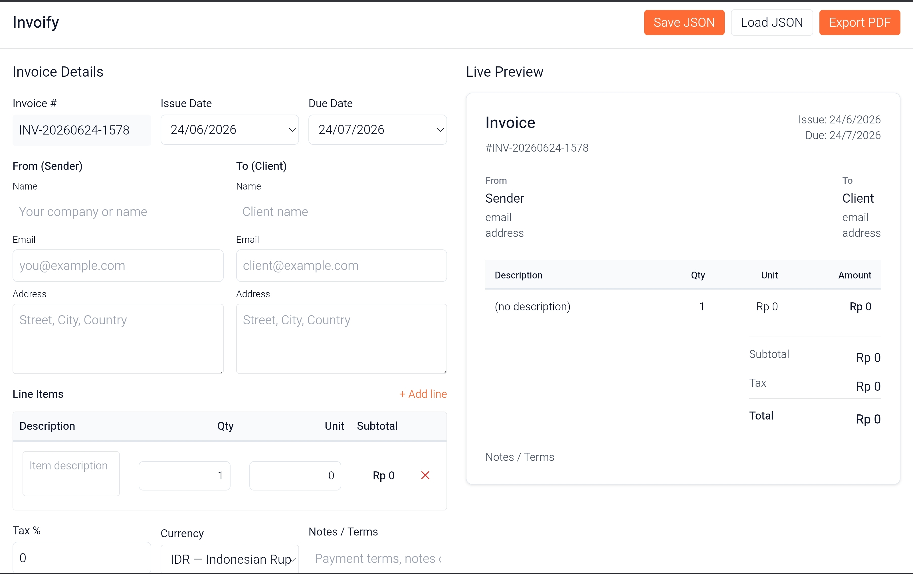

# 🧾 Invoify

> **Free, open-source invoice generator — runs in browser, export to PDF. No backend needed.**

[](https://invoify-wheat.vercel.app)
[](https://opensource.org/licenses/MIT)
[](https://html5.spec.whatwg.org/)
[](https://www.w3.org/Style/CSS/)
[](https://developer.mozilla.org/en-US/docs/Web/JavaScript)
[](https://tailwindcss.com/)

---

## 📸 Preview



---

## ✨ Features

- ✅ **Create professional invoices** with just a few clicks
- ✅ **Live preview** — see your invoice update in real-time as you type
- ✅ **Multiple currencies** — supports IDR, USD, EUR with proper locale formatting
- ✅ **Dynamic line items** — add/remove products or services on the fly
- ✅ **Auto-calculations** — subtotal, tax, and total calculated automatically
- ✅ **Export to PDF** — download your invoice as a professional PDF file
- ✅ **Save/Load as JSON** — save your invoice data locally or load from a file
- ✅ **Auto-save to browser** — your data persists automatically in localStorage
- ✅ **Fully responsive** — works beautifully on desktop, tablet, and mobile
- ✅ **No backend required** — 100% client-side, runs in any modern browser
- ✅ **No npm/build tools** — just open `index.html` and start using it

---

## 🚀 Quick Start

### 3 Easy Steps:

1. **Download or clone the repository**
   ```bash
   git clone https://github.com/kirimoteam/Invoify.git
   cd Invoify
   ```

2. **Open in your browser**
   - Simply open `index.html` in any modern web browser
   - No server or installation required!

3. **Start creating invoices**
   - Fill in your details and client information
   - Add line items for products/services
   - Set tax percentage and currency
   - Preview your invoice in real-time
   - Export as PDF or save as JSON

---

## 📋 How to Use

### Creating an Invoice

1. **Invoice Details**
   - Invoice number (auto-generated)
   - Issue date & due date
   - Select your preferred currency

2. **From Section**
   - Enter your name/company name
   - Add your email address
   - Include your business address

3. **To Section**
   - Enter client/customer name
   - Add their email address
   - Include their address

4. **Line Items**
   - Click **"+ Add line"** to add products/services
   - Enter description, quantity, and unit price
   - Subtotal calculates automatically
   - Click **✕** to remove an item

5. **Tax & Additional Info**
   - Set tax percentage (optional)
   - Add notes, payment terms, or instructions
   - Select your currency

6. **Export or Save**
   - Click **"Export PDF"** to download as PDF
   - Click **"Save JSON"** to save invoice data
   - Click **"Load JSON"** to restore a previous invoice

### Saving Your Work

- **Auto-save**: Your invoice is automatically saved to browser localStorage
- **Manual JSON export**: Click "Save JSON" to download invoice data as a file
- **Load from JSON**: Click "Load JSON" to import a previously saved invoice

---

## 🎨 Design Features

- **Clean, minimal UI** with white background and dark text
- **Accent color**: #FF6B35 (warm orange) for interactive elements
- **Professional typography** — system font stack for optimal readability
- **Dark mode friendly** — uses appropriate contrast ratios
- **Accessible** — keyboard navigation and screen reader support
- **Responsive layout** — adapts seamlessly from mobile to desktop

---

## 🛠️ Tech Stack

| Technology | Purpose | Badge |
|-----------|---------|-------|
| **HTML5** | Structure & Semantic Markup |  |
| **CSS3** | Styling & Responsiveness |  |
| **Vanilla JavaScript** | Core Logic & Interactivity |  |
| **Tailwind CSS** | Utility-first CSS Framework |  |
| **jsPDF** | PDF Generation |  |
| **html2canvas** | Canvas Screenshot |  |

### No Dependencies Required
- ✅ No npm packages
- ✅ No build process
- ✅ No Node.js
- ✅ All libraries loaded from CDN
- ✅ Works with just a file server or `file://` protocol

---

## 📁 File Structure

```
Invoify/
├── index.html          # Main HTML template
├── style.css           # Custom styling & utilities
├── app.js              # Core application logic
├── pdf.js              # PDF export functionality
├── README.md           # This file
└── LICENSE             # MIT License
```

### File Descriptions

- **index.html** — Complete HTML structure with Tailwind CDN and form layout
- **style.css** — Custom CSS including form elements, tables, print styles, and accessibility
- **app.js** — State management, calculations, live preview updates, localStorage handling
- **pdf.js** — PDF generation using jsPDF and html2canvas libraries

---

## 💻 Browser Support

| Browser | Support | Notes |
|---------|---------|-------|
| Chrome | ✅ Full | Latest 2 versions |
| Firefox | ✅ Full | Latest 2 versions |
| Safari | ✅ Full | Latest 2 versions |
| Edge | ✅ Full | Latest 2 versions |
| Opera | ✅ Full | Latest 2 versions |
| IE 11 | ❌ No | Not supported |

---

## 🌍 Currency Support

Invoify supports **3 major currencies** with proper locale-specific formatting:

### Supported Currencies

| Currency | Code | Format Example | Locale |
|----------|------|-----------------|--------|
| Indonesian Rupiah | IDR | Rp 1.000.000 | id-ID |
| US Dollar | USD | $1,000.00 | en-US |
| Euro | EUR | 1.000,00 € | de-DE |

Each currency formats numbers according to regional conventions automatically.

---

## 📝 Example Invoice

```
INVOICE #INV-20240624-0001

Issue: 24/06/2024          Due: 24/07/2024

FROM                       TO
PT Invoify                 Acme Corporation
invoify@example.com        contact@acme.com
Jakarta, Indonesia         New York, USA

DESCRIPTION      QTY    UNIT PRICE    AMOUNT
Web Design       1      Rp 5.000.000  Rp 5.000.000
SEO Services     3      Rp 1.000.000  Rp 3.000.000

                               SUBTOTAL  Rp 8.000.000
                               TAX (10%) Rp   800.000
                               TOTAL     Rp 8.800.000

NOTES / TERMS
Please transfer payment to bank account within 30 days of invoice date.
Thank you for your business!
```

---

## 🔒 Privacy & Security

- **100% Client-Side** — All data processing happens in your browser
- **No Server Communication** — No data is sent anywhere
- **No Tracking** — No analytics or telemetry
- **No Ads** — Completely ad-free
- **Open Source** — Code is transparent and auditable

---

## 📦 Installation & Deployment

### Local Usage
```bash
# Clone the repository
git clone https://github.com/kirimoteam/Invoify.git
cd Invoify

# Open in browser (no server needed!)
open index.html
# or just double-click index.html
```

### Self-Hosted
```bash
# Using Python 3
python -m http.server 8000

# Using Node.js http-server
npx http-server

# Using PHP
php -S localhost:8000
```

Then open `http://localhost:8000` in your browser.

### GitHub Pages
1. Fork the repository
2. Go to Settings → Pages
3. Set Source to `main` branch
4. Your invoice generator is live at `https://yourusername.github.io/Invoify/`

---

## 🐛 Troubleshooting

### Invoice doesn't update in preview
- Make sure JavaScript is enabled in your browser
- Try refreshing the page
- Check browser console for errors (F12)

### PDF export not working
- Ensure pop-ups are not blocked
- Check that you have latest Chrome/Firefox
- Try exporting a simpler invoice first

### Lost my data
- Data is stored in browser localStorage
- Clearing browser cache will delete it
- Always export as JSON to backup important invoices
- Use "Load JSON" to restore backed-up invoices

### Calculations seem wrong
- Ensure all fields are filled with valid numbers
- Check tax percentage is correct
- Verify quantities and unit prices

---

## 🚀 Future Enhancements

Potential features for future versions:
- [ ] Multiple invoice templates
- [ ] Business logo upload
- [ ] Email invoice directly
- [ ] Invoice history & archive
- [ ] Payment tracking
- [ ] Recurring invoices
- [ ] Multi-language support
- [ ] Dark mode theme
- [ ] Invoice templates library
- [ ] QR code for payments

---

## 🤝 Contributing

Contributions are welcome! Here's how you can help:

1. **Fork** the repository
2. **Create a feature branch** (`git checkout -b feature/amazing-feature`)
3. **Commit your changes** (`git commit -m 'Add amazing feature'`)
4. **Push to the branch** (`git push origin feature/amazing-feature`)
5. **Open a Pull Request**

### Contribution Guidelines
- Follow the existing code style
- Add comments for complex logic
- Test in multiple browsers
- Keep file sizes minimal
- No external dependencies (use CDN only)

---

## 📄 License

This project is licensed under the **MIT License** — see the [LICENSE](LICENSE) file for details.

You're free to:
- ✅ Use commercially
- ✅ Modify the code
- ✅ Distribute copies
- ✅ Use privately

Just include the original license notice.

---

## 👨‍💻 Author

**Invoify** is maintained by the [Kirimo Team](https://github.com/kirimoteam)

---

## 🙏 Acknowledgments

- [Tailwind CSS](https://tailwindcss.com/) for the utility CSS framework
- [jsPDF](https://github.com/parallax/jsPDF) for PDF generation
- [html2canvas](https://github.com/niklasvh/html2canvas) for canvas screenshots
- All contributors and users who've provided feedback

---

## 📞 Support

- 📧 **Email**: Open an issue on GitHub
- 🐛 **Bug Reports**: [GitHub Issues](https://github.com/kirimoteam/Invoify/issues)
- 💡 **Feature Requests**: [GitHub Discussions](https://github.com/kirimoteam/Invoify/discussions)
- 📖 **Documentation**: Check this README and code comments

---

## 🌟 Show Your Support

If you find Invoify helpful, please consider:
- ⭐ **Star this repository** — it helps others discover the project
- 🔗 **Share with friends** — spread the word
- 🐛 **Report issues** — help us improve
- 💬 **Provide feedback** — tell us what you think
- 🤝 **Contribute** — submit pull requests with improvements

---

<div align="center">

**Made with ❤️ by [Kirimo Team](https://github.com/kirimoteam)**

[⬆ Back to Top](#-invoify)

</div>
